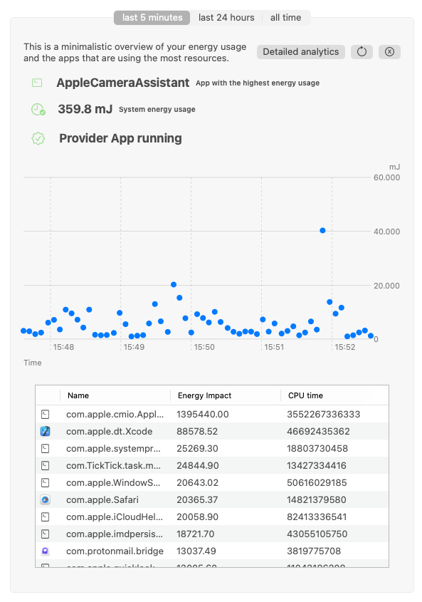

# The Power Hog


The power hog is a tool that periodically collects energy statistics of your mac and makes them available to you.

There are two main aims:

1) Identify which apps are using a lot of energy on your machine.
2) Collecting the data from as many machines as possible to identify wasteful apps globally.

We provide a website for detailed analytics of your data. The hog by default uploads your measurement data to our
[Green Metrics Tool](https://github.com/green-coding-berlin/green-metrics-tool) backend. We put in a lot of effort
to make sure that no confidential information is exposed but please refer to the [settings](#settings) section if you
want to disable the upload or submit the data to your own [backend](https://docs.green-coding.berlin/docs/installation/installation-linux/).

The hog consists of 2 apps that run on your local system. You need to power logger but not the app!

## Power logger

The background process `power_logger.py` which saves the power statists to the database. We use the mac internal
`powermetrics` tool to collect the data. Because the powermetrics tool needs to be run as root so does the power_logger
script. The tool accepts one argument `-d` to run the tool in debug mode. It can also be sent the SIGINFO command to
give some statistics. You can either call it by hand and send it to the background with `&` or define it an agent.
For development purposes we recommend to always first run the program in the foreground and see if everything works fine
and then use the launch agent.

If you want to avoid running the desktop app you can call the `power_logger.py` script with `-w` which will give
you the details url.

You can also run the `powermetrics` process yourself and then use `power_logger.py` to process the data and upload it.
You can use the `-f` parameter with a filename. Please submit the data in the plist format. You can use the following call string:
`powermetrics --show-all -i 5000 -f plist -o FILENAME` and to run the powermetrics process yourself.

### Parameter list

- `-d`: Set's debug/ development mode to true. The Settings are set to local environments and we output statistics when running.
- `-w`: Gives you the url of the analysis website and exits. This is especially useful when not using the desktop app
- `-f filename`: Use the file as powermetrics input and don't start the process internally.

### Setup of the power collection script

This is a description on how to set everything up if you did a git clone. You can also just do

```
curl -fsSL https://raw.githubusercontent.com/green-coding-berlin/hog/main/install.sh | sudo bash
```
which will do the whole install for you.

#### Do it manually

Make the `power_logger.py` script executable with `chmod a+x power_logger.py`

Please modify the `berlin.green-coding.hog.plist` file to reference the right path. There is a script below that does
everything for you.

Place the .plist file in the `/Library/LaunchDaemons` directory.
For security reasons, files in /Library/LaunchDaemons/ should have their permissions set to be owned by root:wheel
and should not be writable by others.

```bash
sed -i.bak "s|PATH_PLEASE_CHANGE|$(pwd)|g" berlin.green-coding.hog.plist
sudo cp berlin.green-coding.hog.plist /Library/LaunchDaemons/

sudo chown root:wheel /Library/LaunchDaemons/berlin.green-coding.hog.plist
sudo chmod 644 /Library/LaunchDaemons/berlin.green-coding.hog.plist

```

After placing the .plist file in the right directory, you need to tell launchd to load the new configuration:

```bash
sudo launchctl load /Library/LaunchDaemons/berlin.green-coding.hog.plist
```

You can check if your service is loaded with:

```bash
sudo launchctl list | grep berlin.green-coding.hog
```

If you want to unload or stop the service:

```bash

sudo launchctl unload /Library/LaunchDaemons/berlin.green-coding.hog.plist
```

### Settings

It is possible to configure your own settings by using a `settings.ini` file in the same directory as the `power_logger.py`
script. Or adding a `hog_settings.ini` file to `/etc/`. This will file will be prioritized.

Following keys are currently used:

- `powermetrics`: This is the delta in ms that power metrics should take samples. So if you set this to 5000 powermetrics will return the aggregated values every 5 seconds
- `upload_delta`: This is the time delta data should be uploaded in seconds.
- `api_url`: The url endpoint the data should be uploaded to. You can use the https://github.com/green-coding-berlin/green-metrics-tool if you want but also write/ use your own backend.
- `web_url`: The url where the analytics can be found. We will append the machine ID to this so make sure the end of the string is a `=`
- `resolve_coalitions`: The way macOS works is that it looks as apps and not processes. So it can happen that when you look at your power data you see your shell as the main power hog.
        This is because your shell has probably spawn the process that is using a lot of resources. Please add the name of the coalition to this list to resolve this error.

## The desktop App

The hog desktop app gives you analytics of the data that was recorded. Please move this into your app folder.

### Description of the headings

- `Name`: This is the name of the process coalition. A coalition can be multiple processes. For example a program might fork
        new process which will all show up in the coalition. Sometimes a shell might turn up here. Please tell us so we can
        add this as an exception
- `Energy Impact`: This is the value mac gives it's processes. The exact formula is not known but we know that quite some
        factors are considered [some details](https://blog.mozilla.org/nnethercote/2015/08/26/what-does-the-os-x-activity-monitors-energy-impact-actually-measure/).
         For now this is the best value we've got 🫣
- `AVG Cpu Time %`: This is how long this coalition has spent on the CPUs. We take a percentage which can be over 100% as
        the coalition could run on multiple cpus at the same time. So if a process takes up 100% of cpu time and runs on 4 cpus
        the time will be 400%.

## Database

All data is saved in an sqlite database that is located under:

```bash
/Library/Application Support/berlin.green-coding.hog/db.db
```

## Updating

We currently don't support an automatic update. You will have to:

- Download the current app and move it into your Applications folder from https://github.com/green-coding-berlin/hog/releases . The file will be called `hog.app.zip`
- Rerun in the install script which will overwrite any custom changes you have made!
```
sudo mv /etc/hog_settings.ini /etc/hog_settings.ini.back
curl -fsSL https://raw.githubusercontent.com/green-coding-berlin/hog/main/install.sh | sudo bash
```

## Contributing

PRs are always welcome. Feel free to drop us an email or look into the issues.

The hog is developed to not need any dependencies.

## Screenshots



## Sources

- Logo from https://pixabay.com/de/vectors/schwein-schweinchen-ferkel-2660356/
- Caribou (Public Domain) lib from https://raw.githubusercontent.com/clutchski/caribou/master/caribou.py

## Misc

- If you can't see the hog logo in the menu bar because of the notch there are multiple solutions.
  - you can use a tool like https://www.macbartender.com/Bartender4/
  - you can use the the command `$ sudo /usr/local/bin/hog/power_logger.py -w` to display the url.
